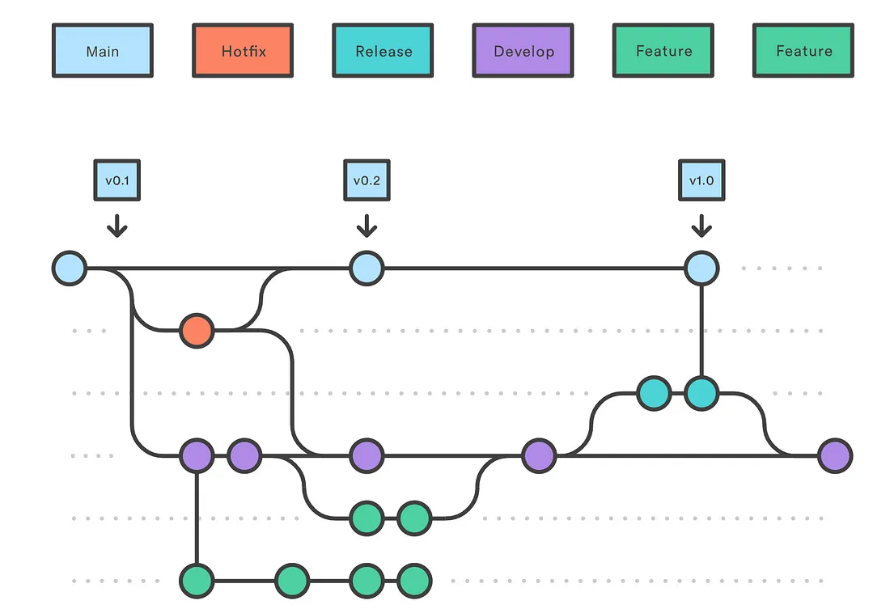

# WhoKnows Search Engine

A search engine originally developed by Monks in 2009, now being modernized by the next generation ('Debugger Demons').

## Project Overview

This repository contains both the legacy search engine and its modern rewrite, demonstrating the evolution from a Python-based monolith to a modern Rust-based system.

## 📖 Documentation

### Centralized Documentation
- [Documentation Hub](docs/index.md) - Central navigation for all documentation
- [Getting Started](docs/Getting-Started.md) - Quick introduction for new developers

### Component Documentation
- **Backend**: [README](backend/README.md) | [Documentation](backend/docs/index.md)
- **Frontend**: [README](frontend/README.md) | [Documentation](frontend/docs/index.md)

### Modern System
- [Modern System Documentation](README.rust.md) - Overview of the Rust implementation

### DevOps Implementation
- [DevOps Implementation Checklist](docs/devops-docs/DevOps_Checklist.md) - Week-by-week DevOps implementation tasks and progress

## 🏗️ Repository Structure

```
whoknows/
├── docs/                 # Project-wide documentation
├── backend/              # Rust backend service
│   ├── src/              # Backend source code
│   └── docs/             # Backend documentation
├── frontend/             # Frontend service
│   ├── src/              # Frontend source code
│   └── docs/             # Frontend documentation
└── README.md             # This file
```

## 🔭 Vision and Goals

- Evolution from a **basic search engine** to a **modern knowledge _discovery_ platform**
- Implementing modern architectural patterns and best practices
- Facilitating both **human and _agent_ knowledge discovery**
- Enhanced data processing through **graph database integration**

## 🏛️ Legacy Analysis

Our analysis of the legacy codebase revealed significant technical debt and security concerns:

- [Detailed Problems Analysis](docs/Legacy_Analysis/list_problems_Legacy_Codebase.md)
- [Tech Stack Architecture](docs/Legacy_Analysis/legacy.tech_stack_architecture.png)
- [Dependency Graph](docs/Legacy_Analysis/legacy.dependency_graph.svg)

Key findings include SQL injection vulnerabilities, outdated dependencies, and architectural issues that necessitated our modernization effort.

## 💻 Technology Stack Evolution

| Component       | Legacy (2009)    | Modern                    | Purpose         |
| --------------- | ---------------- | ------------------------- | --------------- |
| Language        | Python 2.7       | Rust 1.5                  | Core Runtime    |
| Web Framework   | Flask 0.5        | Actix-web 4.4.0           | HTTP Server     |
| Template Engine | Jinja2 2.4       | Client-side JavaScript    | UI Rendering    |
| ORM/DB Access   | Raw SQL          | SQLx 0.7                  | Data Access     |
| Database        | SQLite           | Neo4j + SQLite            | Data Storage    |
| Serialization   | Built-in         | Serde 1.0                 | Data Processing |
| Async Runtime   | N/A              | Tokio 1.0                 | Concurrency     |
| Logging         | Print statements | env_logger 0.10 + log 0.4 | Observability   |

### Legacy Stack Challenges
- Python 2.7 (EOL since 2020)
- Outdated dependencies with no security updates
- Limited scalability and performance
- No modern development tooling support
- Critical security vulnerabilities
- Poor error handling and logging
- Architectural limitations

### Modern Stack Benefits
- Type safety and performance with Rust
- Robust async processing capabilities
- Enhanced security and maintainability
- Modern development workflow support
- Graph database for advanced data relationships
- Comprehensive error handling
- Modern security practices

## 🚀 Getting Started

To get started with the WhoKnows project:

1. Read the [Getting Started Guide](docs/Getting-Started.md)
2. Set up your development environment using the [Setup Guide](docs/development/setup.md)
3. Understand our [Git Workflow](docs/VCS/VCS-Git-flow.md)
4. Explore the [Backend](backend/README.md) and [Frontend](frontend/README.md) documentation

## 🌿 Branching Strategy

We are using Gitflow branching strategy. Below is a visualization of the given strategy:


## 📝 License

This project is licensed under the terms included in [LICENSE](LICENSE).
