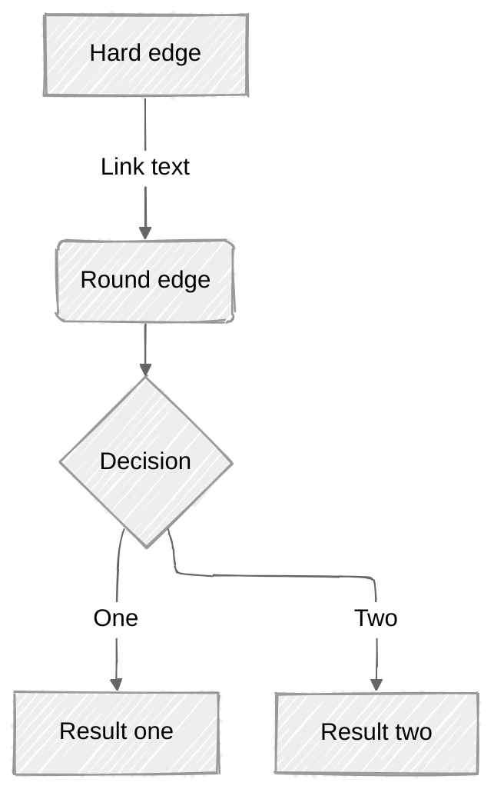

# mermaid-cli use

## CLI cmds 

**install**
```bash
npm install -g @mermaid-js/mermaid-cli
```

**usage**
```bash
mmdc -i input.mmd -o output.svg

# fx. nmdc ./docs/mmd/cd.prod.yml.mmd -o ./docs/diagrams/cd.prod.yml.svg
```


## syntax for .mmd files



